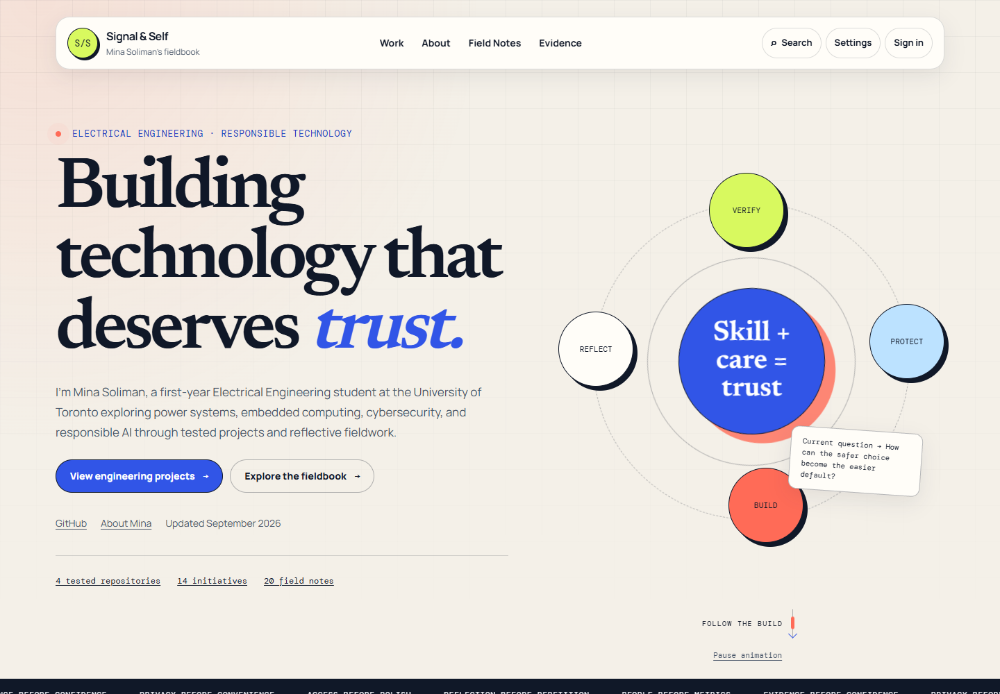
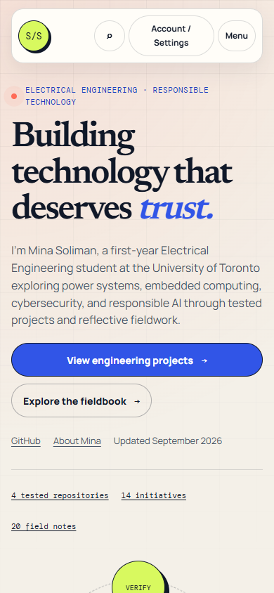

# Homepage animation revision

September 3, 2026. After reviewing the initial audit implementation, Mina preferred the original animated homepage. This revision follows that preference and supersedes the initial audit's more static homepage presentation.

The original rotating Verify / Protect / Build / Reflect compass is restored beside the hero, along with its angled question card, “Building technology that deserves trust” headline, pulsing dot, scrolling principles strip, and animated reading cue. Sections move gently into place without ever hiding their content. The four engineering projects, current introduction, navigation, and privacy boundaries are retained. The rest of the site is unchanged.

The homepage has a keyboard-operable Pause animation control. The text strip also pauses on hover or focus, and reduced-motion mode disables animation and shows the principles as wrapped static text. The reading cue stays within the hero rather than covering page content. Animation assets load only on the homepage.

## Verification

`python tools/validate_site.py`, JavaScript syntax validation, and `node tools/qa/homepage-motion.mjs` passed. The focused browser run recorded 18 successful checks, no JavaScript errors, no overflow at 320/390/768/1024/1440 pixels, and zero axe violations in all three themes. It checked that animation advances, keyboard pause/resume works, keyboard focus pauses the strip, and reduced motion stops the compass and strip.

| Homepage measurement | Mobile | Desktop |
|---|---:|---:|
| Lighthouse Performance | 94 | 100 |
| Accessibility | 100 | 100 |
| SEO | 100 | 100 |
| LCP | 2.305 s | 0.496 s |
| CLS | 0.0007 | 0.0044 |

Same local Lighthouse settings as the initial audit. This is lab evidence, not production field performance. Other routes were unchanged; their earlier measurements remain in the [audit report](ux-audit-results.md). The original screen-reader, real Google callback, and field-data limitations still apply.

[Recorded checks and metrics](qa/homepage-motion/results.json).

| Desktop | Mobile |
|---|---|
|  |  |

[1024](qa/homepage-motion/home-1024.png) · [768](qa/homepage-motion/home-768.png) · [320](qa/homepage-motion/home-320.png)

The existing review PR is updated with this follow-up commit. Nothing is merged or deployed.
