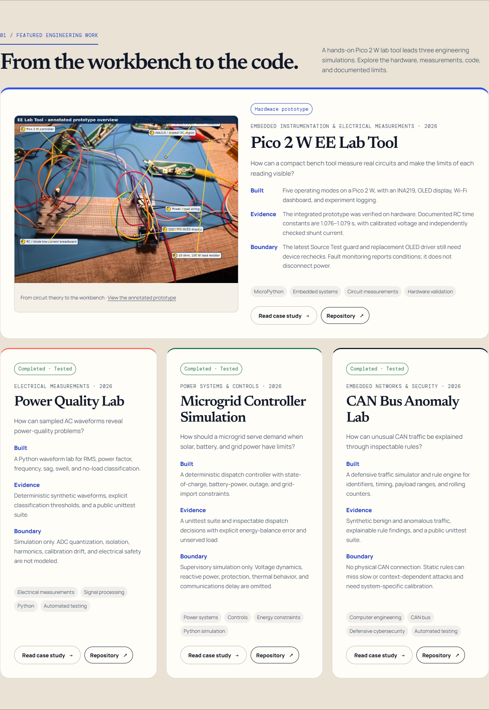
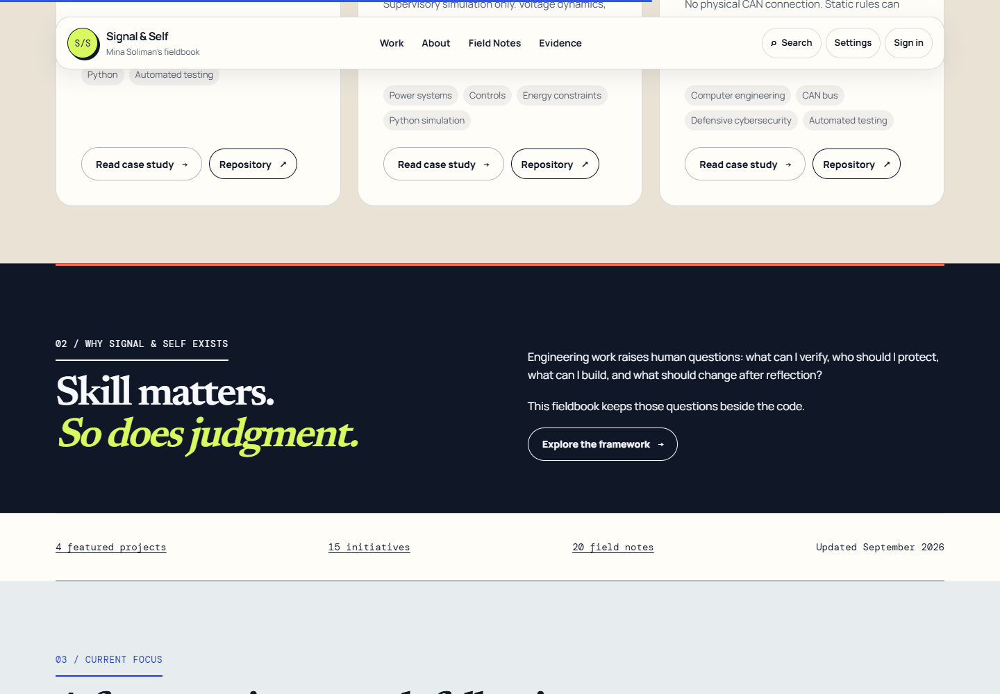

# Pico feature and section clarity

September 3, 2026. The moving bar now reads: **Embedded systems · Power & energy · Test. Measure. Refine. · Thoughtful engineering · Build with purpose.** Animation, focus/hover pause, keyboard pause/resume, and reduced-motion support remain intact.

## Featured work

Pico 2 W EE Lab Tool is the first, larger feature, using its published annotated prototype image. Power Quality Lab, Microgrid Controller Simulation, and CAN Bus Anomaly Lab follow. Trailhead is removed from featured work but retained in the full project library, search, and its existing case-study URL. The Work page defaults to the same four featured projects; “All engineering builds” shows all five. The source now contains 15 initiatives, 5 engineering projects, and 4 featured projects. Counts, metadata, README, and search are synchronized.

The Pico repository was verified as **public** on September 3. The local nested checkout contained an older export, so it was left untouched and the current published README was used instead:

- [README](https://github.com/Mini34/pico-2w-power-transient-analyzer/blob/main/README.md), blob `609c316bcee0eb5bb70ba7c90bfea9e8017c4fd6`.
- [Published prototype image](https://github.com/Mini34/pico-2w-power-transient-analyzer/blob/main/images/designs/01_annotated_prototype_overview.png), blob `0e5260d9afe9f289aa71e48309e14e6916ac7315`.

The five-mode prototype and example readings come from that README. The feature explicitly preserves the pending on-device rechecks for the updated Source Test guard and replacement OLED driver, and distinguishes software monitoring from power disconnection. No fresh hardware test or fully validated current firmware is claimed. The prototype PNG was converted to lossless WebP with identical decoded pixels: 1,951,279 → 1,401,990 bytes. It is served locally, with intrinsic dimensions and lazy loading; no new third-party browser request was added.

## Section boundaries

Numbered chapter labels, divider rules, and full-width background bands distinguish Featured Work, the fieldbook framework, current focus, and notes. The navy fieldbook band has explicit button and focus colors. The lead project pairs the real hardware image with evidence and limitations, followed by three smaller project cards. Mobile collapses the layout into one column.

## Verification

The site validator and JavaScript syntax checks passed. The complete interaction run passed **145 checks** on **13 public pages**, including Pico-first ordering, Trailhead exclusion from features and inclusion in the complete engineering filter, seven responsive widths, no-JavaScript content, saved items, dialogs, search, and chart controls. **52 axe scans** across themes and mobile reported zero violations; no JavaScript page errors occurred. The focused motion suite adds 18 passing checks. No changes were made to Google identity or aggregate analytics.

[Full interaction results](qa/pico-feature/interactions.json) · [Motion checks and current homepage Lighthouse measurements](qa/pico-feature/results.json).

The earlier audit's real screen-reader, real Google credential, actual Windows high-contrast/browser-zoom, and production field-data limitations remain. This is a review-branch update; nothing has been merged or deployed.

## Current screenshots

Featured section, isolated from the sticky navigation for the component capture:

Contrasting section bands in the actual viewport:

[Desktop homepage](qa/pico-feature/home-1440.png) · [Mobile homepage](qa/pico-feature/home-390.png).
