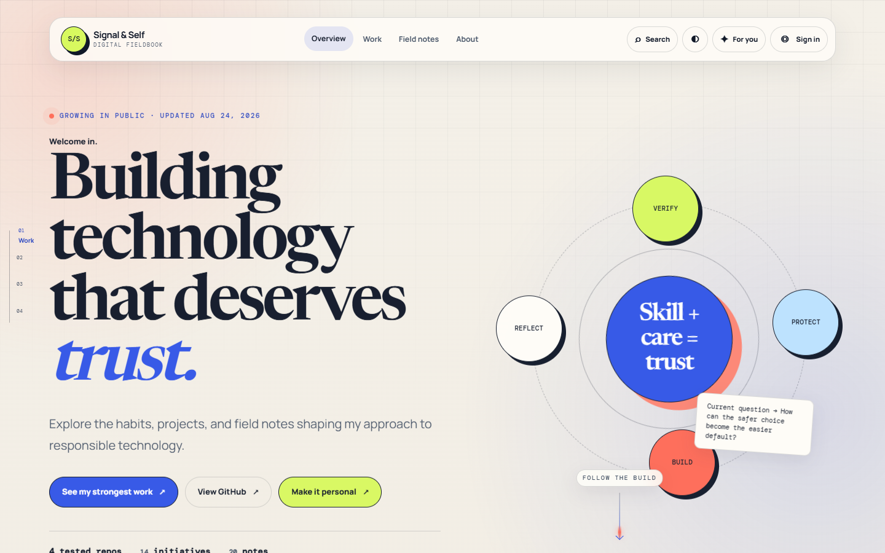
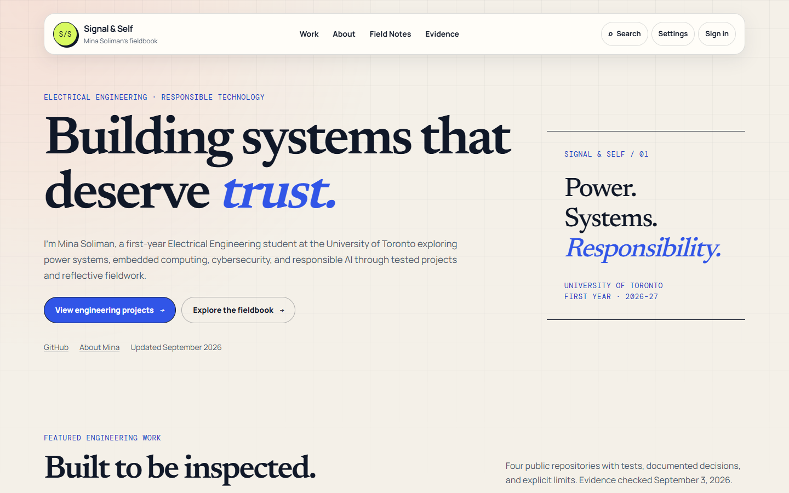
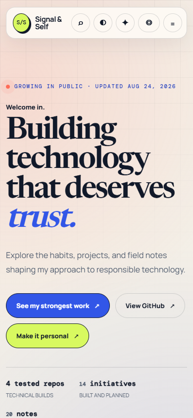

# Signal & Self UX refresh — review results

September 3, 2026 · `codex/ux-audit-priority-refresh` · compare with [the captured baseline](ux-audit-baseline.md).

**Latest revision:** [Pico now leads featured work, the moving bar has new copy, and sections have clearer boundaries](pico-feature-review.md). The current collection has 15 initiatives and 5 engineering projects, with 4 featured. Historical counts, screenshots, and measurements below describe the initial audit proposal.

**Homepage revision after owner review:** Mina preferred the original animation. The compass, scrolling strip, pulse, and section motion are restored in the hero. See [the current homepage and its new measurements](homepage-motion-review.md). The homepage screenshots and measurements below record the initial, more static proposal; all other route results remain applicable.

## Result and content decisions

The homepage now identifies Mina Soliman, first-year Electrical Engineering at the University of Toronto, technical interests, and the primary project action before the fieldbook framework. Four engineering repositories lead the work library, with consistent dedicated case studies and visible validation/limitations. Work, About, Field Notes, and Evidence are primary navigation; Journey and Privacy remain in the footer. Existing page URLs remain valid.

The original palette, serif/sans/mono families, paper grid, monogram, compass, three themes, six-part framework, seven values, all 14 initiatives, and all 20 notes are retained. Only the compass has continuous decorative motion; reduced motion disables it. All collections are static readable HTML, enhanced by search, filters, saving, and optional dialogs. Settings no longer replaces the owner's hero identity with visitor copy. Field Notes begins with five selected notes, defaults to newest, adds takeaways derived from the existing text and word-count reading estimates, and links related projects.

July 2026 metrics are explicitly historical snapshots. Practice scores remain inside methodology disclosures while qualitative bands, evidence links, and the August 24 review date lead. The prior current-focus record keeps its August 24 date; the site refresh does not pretend the underlying project work was re-verified as new progress. The past-due review date is removed. The roadmap now says First year, 2026–27. The new September 3 journey entry records this actual website refresh, bringing the existing 19 updates to 20. Counts, metadata, static content, and optional data payloads come from one authoring record; README counts are checked against it.

**No achievements, measurements, project-completion dates, or personal details were invented.** New dates identify this website work or actual source inspection. No résumé, LinkedIn, email address, contact form, or contact route was invented. Only the already-public GitHub profile is used. Missing project-specific role claims were omitted rather than inferred. Proposed next steps are explicitly prospective, not completed outcomes. Optional “What changed afterward?” fields were not filled without evidence.

## Repository evidence

The four project READMEs were inspected through GitHub on September 3. These exact source blob IDs are retained in the authoring records. Case studies cite the repositories' documented tests and limitations; this website task did **not** rerun those repositories' test suites or physically validate hardware.

| Project | Source | README blob |
|---|---|---|
| Power Quality Lab | [README](https://github.com/Mini34/power-quality-lab/blob/main/README.md) | `0fd61bb22c08998bc9e9260f734aede7ceca21bd` |
| Microgrid Controller Simulation | [README](https://github.com/Mini34/microgrid-controller-sim/blob/main/README.md) | `e434ce83da9ae1b0b1e460deb4961e6676bdb2f1` |
| CAN Bus Anomaly Lab | [README](https://github.com/Mini34/can-bus-anomaly-lab/blob/main/README.md) | `cac6a386570f312c48edb89c70c740ba40d2572a` |
| Trailhead Customer Support API | [README](https://github.com/Mini34/trailhead-claude-support-api/blob/main/README.md) | `3bea478d81efc791ec898f1f2ed6b0f00302b764` |

## Identity, preferences, and analytics

**Google identity and Cloudflare analytics remain separate. Aggregate analytics work without sign-in, and no persistent named viewer record was added.** The unchanged Cloudflare loader is present exactly once on every public page, only loads on `mini34.github.io`, and sends the existing fixed beacon token configuration. Behavioral tests execute that production-hostname branch without any viewer or preference state, and deliberately throw if private state is accessed. Local previews never load the beacon. This is code-level verification; it does not claim a new deployment or access to a private analytics dashboard.

Desktop retains a secondary Sign in control; mobile combines Account / Settings with a visible optional Google sign-in action. Merely opening Settings does not load Google. Deliberate account activation loads the external Google library; failed loads can be retried. The email and stable subject identifier are not stored, the ID token is discarded, and only display name, picture, and expiry persist in session storage. Sign-out clears the viewer state. Blocked storage falls back to in-memory presentation on the current page. Themes, audience, local name/goal, and saved items remain device-local and never feed the analytics loader. The account panel and Privacy page explain each boundary.

The callback tests use synthetic credentials and a mocked Google interface. The real Google account selection and credential callback were not exercised. Client-side presentation state does not provide authentication for private content.

## Accessibility and responsive verification

- Automated interaction checks cover all 12 public pages at 320, 375, 390, 430, 768, 1024, and 1440 CSS pixels, with no horizontal overflow.
- Axe scans cover all 12 pages in all three desktop themes and a 390-pixel mobile scan: 48 scans, zero reported violations. Separate Lighthouse/axe audits cover the seven original routes.
- Keyboard interaction checks cover Settings, focus restoration, search/Escape, note readers, filters, deep links, saved items, chart period controls, adoption-year keys/live text, Journey download, and the native mobile menu. Native modal dialogs keep the background inert and restore the opener.
- Manual in-app-browser keyboard smoke test: Tab/Enter activates the skip link; Ctrl+K opens search; a Microgrid query returns results; Tab cycles within the dialog; Escape closes it and returns focus. The accessibility tree exposed the modal content while the background was inert. This is not a screen-reader speech test.
- Principal identity/content/navigation remain readable with JavaScript disabled on all 12 routes. Blocking all JSON still leaves the Work collection usable. Normal scripted navigation produced no JavaScript page errors.
- Reduced-motion emulation disables the compass animation. Forced-colors emulation retains readable structure and focus treatment; [capture](qa/final/home-forced-colors.png). Important mobile utility buttons are at least 44×44 pixels, and the menu uses the same minimum size.
- Reflow was checked at equivalent 200% and 400% widths (a 1280-pixel layout reduced to 640/320 CSS pixels). These checks do not claim actual browser zoom, Windows high-contrast settings, or screen-reader speech was operated. Those human/device checks remain open.

## Performance and delivery

The shared controller is 9,368 bytes; Work/Notes/Journey add only their 4,773-byte collection behavior, and Evidence adds 3,751 bytes. Pages no longer download the 69,224-byte authoring record. Normal visits load no JSON except the Evidence page's 4,115-byte chart/map payload; Settings fetches 1,281 bytes on demand and Search 19,028 bytes on demand. Figures are source bytes, not compressed production network transfers.

The same typefaces are served locally as WOFF2 Latin/extended-Latin subsets with full system fallbacks, `font-display: swap`, and primary-font preloads. Font payloads total 208,668 bytes versus 789,052 source TTF bytes; only used weights are requested by the browser. There are no Google Fonts requests and no additional runtime dependencies. Font licensing/provenance is included in [assets/fonts](../assets/fonts/README.md).

The adoption image is lazy-loaded only on Evidence with intrinsic 7001×4001 dimensions. The 1200×630 social PNG was losslessly compressed from 1,218,958 to 1,200,542 bytes; decoded RGBA pixels were verified identical. [Compression evidence](qa/final/image-compression.json).

Final measurement uses the retained full seven-route run below. All 14 Lighthouse runs scored **100 Accessibility and 100 SEO**. All mobile CLS values were zero. Mobile LCP meets the 2.5-second target on six routes; About measured **2.556 seconds**, missing it by 56 ms. That near-target result is reported as a remaining limitation, not silently rounded down.

| Page | Mobile performance | Mobile LCP (ms) | Mobile CLS | Desktop performance | Desktop LCP (ms) | Desktop CLS |
|---|---:|---:|---:|---:|---:|---:|
| home | 98 | 2258 | 0.0000 | 100 | 527 | 0.0047 |
| work | 97 | 2275 | 0.0000 | 100 | 486 | 0.0001 |
| about | 95 | 2556 | 0.0000 | 100 | 527 | 0.0001 |
| notes | 98 | 2253 | 0.0000 | 100 | 483 | 0.0001 |
| evidence | 96 | 2294 | 0.0000 | 100 | 485 | 0.0014 |
| journey | 98 | 2254 | 0.0000 | 100 | 483 | 0.0001 |
| privacy | 99 | 2107 | 0.0000 | 100 | 445 | 0.0001 |

These are local lab runs with the same Lighthouse settings as the baseline, not a production speed guarantee. Development serving uses no-store and no HTTP compression, so production caching/compression differ. Do not interpret small desktop timing differences as statistically significant. Field INP is not measurable from this audit; the 200 ms target requires sufficient post-release real-user data. The production Cloudflare beacon is intentionally absent in these preview runs. No new performance monitor was scheduled.

## Validation and CI

The dependency-free validator checks 12 pages; one nonempty title/H1 and required metadata; canonical/OG alignment; unique titles and IDs; local links, anchors and CSS/font assets; authoring IDs/counts and generated output; current/historical status; repository evidence paths; lastUpdated consistency; theme contrast; analytics inclusion/hostname/privacy boundaries; and lazy session-only Google integration. Sitemap, robots, JSON-LD, and a useful root-relative GitHub Pages 404 are generated together.

Commands run:

```text
python tools/build_site.py --check
python tools/validate_site.py
node --check assets/scripts/*.js  (each script individually)
node --test tools/qa/privacy.test.mjs
node tools/qa/interactions.mjs
node tools/qa/audit.mjs final
python tools/package_site.py
```

Final output: validator passed; 9 privacy tests passed; 134 interaction checks passed, no JavaScript errors and no axe violations. Machine-readable records: [interaction results](qa/final/interactions.json), [Lighthouse and axe results](qa/final/results.json). CI runs the validator, JavaScript syntax/privacy tests, and browser interaction/axe checks using pinned development dependencies. Deployment requires both jobs and is excluded for pull requests. Only public pages/assets are packaged; tooling, reports, and screenshots are excluded from the deployed artifact.

## Review images

| Desktop, before | Desktop, after |
|---|---|
|  |  |

| Mobile, before | Mobile, after |
|---|---|
|  |  |

Additional after captures: [1024](qa/final/home-1024.png), [768](qa/final/home-768.png), [320](qa/final/home-320.png).

## Deferred or unverified

Résumé/contact/LinkedIn links need real public URLs. No unsupported “what changed afterward” or additional achievement evidence was added. A real screen-reader smoke test, actual browser zoom and Windows high-contrast checks, real Google credential flow, and post-release Cloudflare field performance need verification on the relevant device/account. They are not silently treated as passed. The requested GitHub review branch and pull request are the delivery boundary; no merge, production deployment, account-tracking backend, or framework migration is part of this change.
